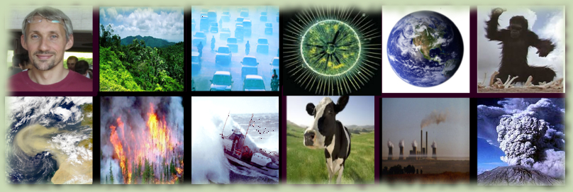
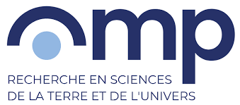
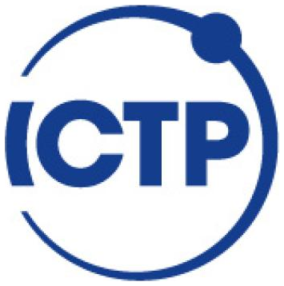

::: {.content-layout .fade-in}

::: {.main-content}

::: {.info-card}
## Research Scientist

::: {.subtitle}
Interactions between atmospheric chemistry, climate and biogeochemical cycles using modelling approaches.
:::
:::

::: {.info-card}
### Short Bio

After a master in Physics and a Ph.D. in Environmental Sciences (prepared at AgroParisTech & Toulouse University), I occupied several positions in France, Italy and the US. I am currently working as a Scientific programmer / Research scientist at ETH Zurich.

For several years, I have also been working as a Research scientist at Observatoire Midi-Pyrénées in Toulouse France and at the Abdus Salam International Center for Theoretical Physics (UNESCO, Trieste, Italy), for which I am still an active collaborator. My main field of expertise relates to atmospheric physics and chemistry (including some biogeochemical aspects), climate-chemistry modelling, and related impact assessments. I use mostly modeling and data analytics approaches.
:::

:::

::: {.sidebar-container}

::: {.sidebar-section}
## Contacts

::: {.info-list}
- <i class="bi bi-geo-alt contact-icon"></i>Universitätstrasse 16 8092 Zürich, Switzerland
- <i class="bi bi-envelope contact-icon"></i>fabien.solmon at env.ethz.ch
:::
:::

::: {.sidebar-section}
## Relevant Links

::: {.info-list}
- [{.logo-img} ETH Zürich - IAC](https://iac.ethz.ch/){target="_blank" rel="noopener"}
- [{.logo-img} Observatoire Midi-Pyrénées](http://www.omp.eu){target="_blank" rel="noopener"}
- [{.logo-img .logo-img-lg} ICTP Trieste](https://www.ictp.it/){target="_blank" rel="noopener"}
:::
:::

:::

:::
