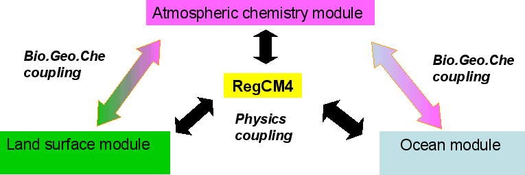
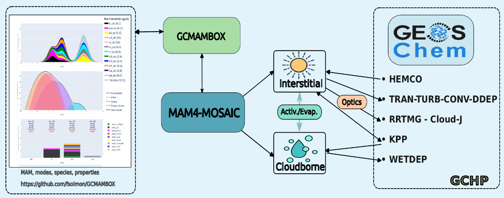

::: {.main-content .fade-in}
Over the years I have used and contributed to developments in different community models including
[`Meso-NH`](http://mesonh.aero.obs-mip.fr/mesonh57){target="_blank" rel="noopener"},
[`GEOS-Chem`](https://geoschem.github.io/){target="_blank" rel="noopener"}
and mostly the [`ICTP RegCM5`](https://github.com/ICTP/RegCM){target="_blank" rel="noopener"}
regional climate model for processes relevant to climate, biogeochemistry and atmospheric chemistry.
:::

::: {.full-width-section .fade-in}
## Model Contributions

::: {.activity-grid}

::: {.activity-card}
### Contribution to RegCM

Development work on the [`ICTP RegCM5`](https://github.com/ICTP/RegCM){target="_blank" rel="noopener"} regional climate model, including:

::: {.development-list}
- The chemistry and aerosol schemes (including dust cycle)
- The interface to the `RRTM`/`McICA` radiation scheme
- The slab-ocean parameterization
- The biogeochemistry interface to the `CLM4.5` surface scheme
- Model diagnostics useful to assess perturbation and feedbacks
:::

[View RegCM interactive examples →](regcm.qmd){.view-link}
:::

::: {.activity-card}
### Contribution to GEOS-Chem

The Modal Aerosol Model
([Liu et al., 2012](https://doi.org/10.5194/gmd-5-709-2012 "Liu, X., Easter, R. C., Ghan, S. J., Zaveri, R., et al.: Toward a minimal representation of aerosols in climate models: description and evaluation in the Community Atmosphere Model CAM5, Geosci. Model Dev., 5, 709-739, 2012."){target="_blank" rel="noopener"}),
interacting with the
Model for Simulating Aerosol Interactions and Chemistry
([Zaveri et al., 2008](https://doi.org/10.1029/2007JD008782 "Zaveri, R. A., Easter, R. C., Fast, J. D., and Peters, L. K.: Model for Simulating Aerosol Interactions and Chemistry (MOSAIC), J. Geophys. Res., 113, D13204, 2008."){target="_blank" rel="noopener"}),
is coupled with the
[`GEOS-Chem`](https://geoschem.github.io/){target="_blank" rel="noopener"}
chemical transport model. This enables a size-resolved representation of aerosol
processes at a lower numerical cost relative to sectional approaches, while also
offering compatibility for coupling with GCMs such as the Community Earth System
Model. In our workflow, `MAM4-MOSAIC` is a library derived from the code version
reported by
[Wu et al. (2022)](https://doi.org/10.1029/2022MS003157 "Wu, M., Wang, H., Easter, R. C., Lu, Z., Liu, X., Singh, B., et al.: Development and evaluation of E3SM-MOSAIC: Spatial distributions and radiative effects of nitrate aerosol, J. Adv. Model. Earth Syst., 14, e2022MS003157, 2022."){target="_blank" rel="noopener"}
`E3SM` implementation. It has been coupled with
GEOS-Chem's chemistry, emissions, transport, deposition, and radiative processes
(including `RRTMG` and `Cloud-J`). A box model version, operated through a `Python`/`Dash`
interface, has also been developed for ideal cases.

[View a GEOS-Chem/MAM interactive example →](gc_sphere_MAM_c48.html){.view-link}
:::

:::
:::
