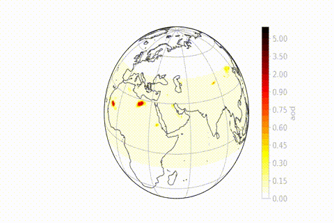

::: {.breadcrumb .fade-in}
[← Modelling Activities](model.qmd) / RegCM
:::

::: {.main-content .fade-in}
## RegCM Examples

Examples of simulations with the [`ICTP RegCM5`](https://github.com/ICTP/RegCM){target="_blank" rel="noopener"}
regional climate model, including chemistry, aerosol and dust cycle developments.
:::

::: {.full-width-section .fade-in}
::: {.simulation-container}
## Example of Simulation

::: {.simulation-description}
RegCM simulation of mid-troposphere ozone (ppb) during the biomass burning season - Dust aod during June 2020 'Godzilla' event
:::

::: {.simulation-images}


:::
:::
:::

::: {.interactive-section .fade-in}
[interactive RegCM5 output](figsliceO3.html){target="_blank" rel="noopener"}

```{=html}
<iframe
  src="https://fsolmon.github.io/website/figsliceO3.html"
  title="Simulated ozone distribution JJA 2012"
  loading="lazy">
  <p>Your browser does not support iframes. Please visit the
  <a href="https://fsolmon.github.io/website/figsliceO3.html" target="_blank" rel="noopener">interactive visualization</a> directly.</p>
</iframe>
```
:::
