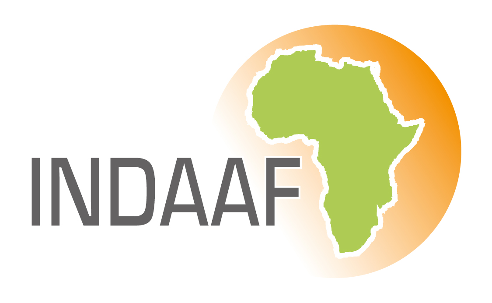
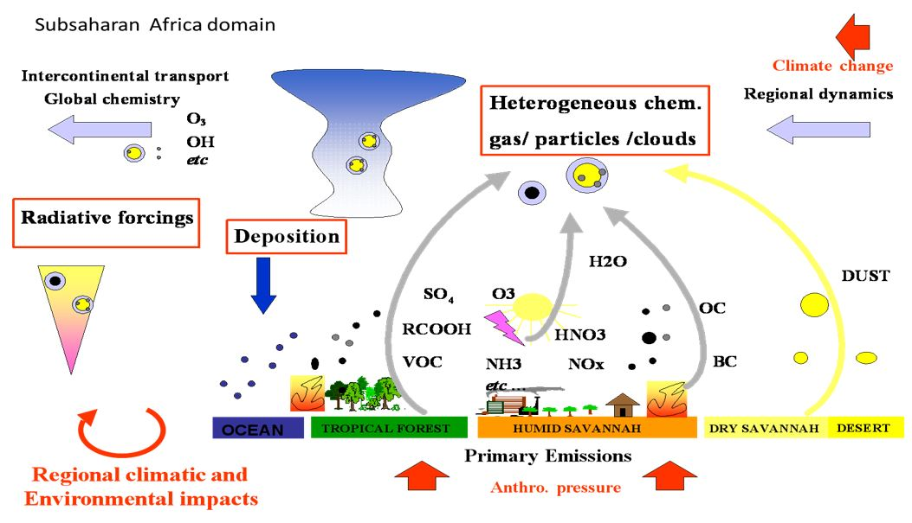

::: {.main-content .fade-in}

::: {.info-card}
## Research Topics

::: {.topics}
- The regional climatic impact of dust and biomass burning aerosol on thermodynamic and dynamics of Monsoon systems (West Africa, India) as well as particular sea basins (Mediterranean, Caspian).
- The direct and semi-direct effects of African biomass burning aerosol on southern African climate and the south eastern Atlantic stratocumulus deck. [Example BBA/WAM here](pres.qmd).
- The tropospheric chemistry over Africa in connection with the regional nitrogen cycle, including the impact of biogenic emissions and climate change.
- The processes impacting the emission and deposition flux of key chemical elements to marine and terrestrial ecosystems (North Pacific Ocean, West Africa and the Mediterranean basin).
- Other topics such as pollen health/climate interactions modelling, biogenic emissions, and forest canopy modelling.
:::
:::

::: {.info-card}
## [{width="50px" style="vertical-align:middle; margin-right:10px;"} The INDAAF International Network to study Deposition and Atmospheric Chemistry in Africa](https://indaaf.obs-mip.fr/fr/accueil/){target="_blank" rel="noopener"}
:::

::: {.info-card}
### Illustration of Coupled Processes

:::

:::
